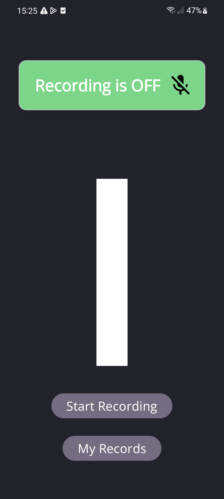
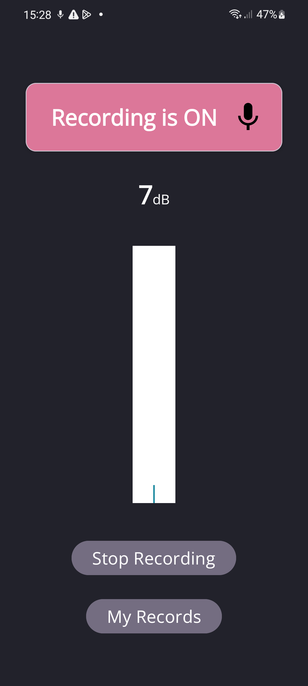
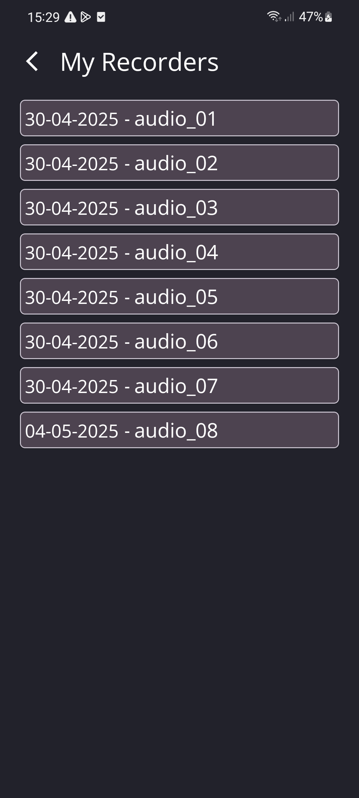

# 📡 Noise Monitoring App

A professional Android application for real-time noise monitoring, audio recording, and analysis. Through foreground and background services, allowing continuous data capture even when the user navigates away from the screen. Visual feedback and smart data analysis provides to the users.

## Screenshots
<p agile=center>
  
</p>

<p agile="center">
  
</p>

<p agile="center">
  
</p>

## ✨ Features

- 🎙️ **Continuous Audio Recording**  
  Utilizes `MediaRecorder` in both foreground and background modes to capture audio consistently, regardless of screen state.

- 🔄 **Persistent Monitoring via BootReceiver**  
  Automatically resumes recording after device restarts, ensuring long-term and uninterrupted monitoring.

- 📊 **Real-Time Sound Visualization**  
  Provides a responsive on-screen visual representation of current noise levels.

- 📈 **Analyzed & Structured Data Output**  
  Captured audio is processed and analyzed to present insightful metrics and trends regarding environmental noise.

---

## 🛠 Technologies Used

- `MediaRecorder` – For audio recording  
- Foreground and background services – For persistent operation  
- `BroadcastReceiver` (BootReceiver) – To handle device restarts  
- Custom visual components – For real-time feedback

---

## 🚀 Getting Started

> This app requires Android Studio and a device or emulator with microphone permissions enabled.

1. Clone the repository  
   ```bash
   git clone https://github.com/TalBar4444/NoiseMonitoring.git
   
2. Open in Android Studio

3. Build and run the app on your Android device

Make sure to grant microphone and background activity permissions for optimal performance.

## 📄 License
This project is licensed under the MIT License.


